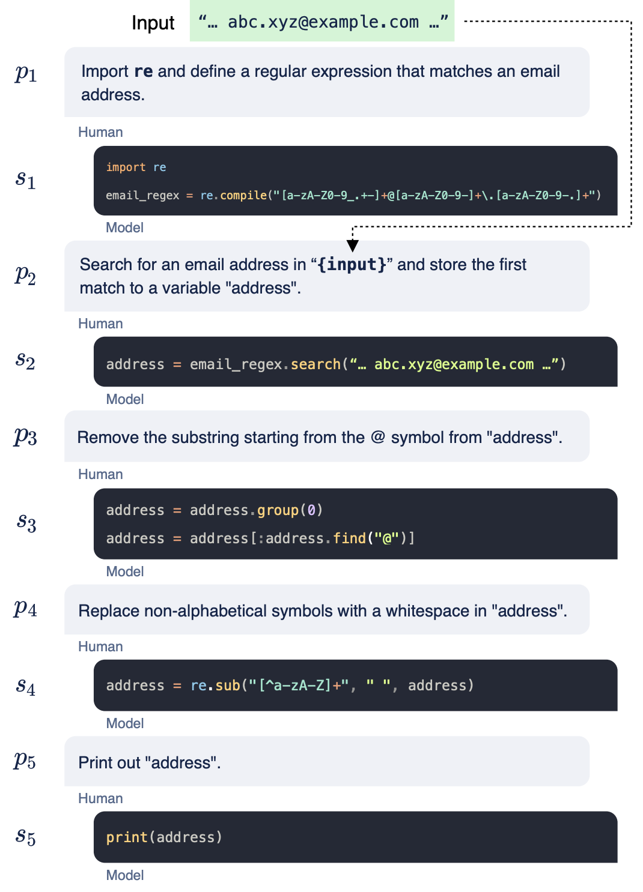

# CodeGen: An Open Large Language Model for Code with Multi-Turn Program Synthesis

## Paper & Repository
- [Paper](https://arxiv.org/pdf/2203.13474)
- [Git Repository](https://github.com/salesforce/CodeGen)

## Challenges of Program Synthesis (Motivation)
- The immense pool of possibilities in the search space creates for a computationally expensive problem.
- The difficulty of translating the user’s intent into a form that the model can understand.

## Key Features & Contributions
### Multi-Turn Program Synthesis
- The user specifies their requirements in multiple steps using natural language. Then, the model will produce programs that target each requirement. In this process, the user and the system iteratively refine the program by communicating with one another. 

### Multi-Turn Programming Benchmark (MTPB)
- This benchmark requires the model to generate code incrementally based on requirements presented by the user in natural language. The performance of the model is gauged based on the number of test cases that pass from the code written by the model.

## Datasets
### The Pile
- This is a natural language dataset composed of English text that was originally collected for language modeling. So, the resulting models are called the natural language CodeGen models (CodeGen-NL).

### BigQuery
- This is a subset of Google’s public BigQuery dataset that pulls from 6 different programming languages: C, C++, Gp, Java, Javascript, and Python. Since this training data contains multiple languages, the resulting set of models are known as the multi-lingual CodeGen models (CodeGen-Multi). 

### Big Python
- This dataset is compiled of public GitHub repositories containing solely Python code. The models that are derived from this training dataset are referred to as mono-lingual CodeGen models (CodeGen-Mono).

## Training
- CodeGen models are autoregressive transformers trained with next-token prediction on both code and natural language.
- Without explicit training on comment-code pairs, the model learns to synthesize programs due to:
  - Large model sizes
  - Extensive training data
  - Training objective (language modeling)
  - Noisy training signals
- Structural training data from repositories provides weak supervision for implicit program synthesis learning.
- Despite noisy training data, zero-shot generalization enables effective synthesis without explicit training on comment-code pairs.

## Testing
- **Single-Turn Code Generation:** Measures correctness of Python code generation in one pass.
- **Multi-Turn Code Generation:** Assesses iterative program refinement based on user interaction.
- **Effect of Scaling:** Evaluates how model size impacts accuracy and quality.
- **Perplexity Analysis:** Determines how well the model understands user prompts.
- **Error Analysis & Failure Cases:** Identifies weaknesses in generated code.

## Tasks
- Program Synthesis
- Multi-Turn Code Generation
- Multi-Language Code Generation
- Zero-Shot Performance

## Strengths
- Multi-Turn Program Synthesis
- Capable of handling complex algorithmic tasks
- Strong understanding of user intent
- Strong zero-shot performance
- Multi-language adaptability
- Open-source and accessible

## Weaknesses
- **Generalist Model:** Not specialized for domains like bioinformatics.
- **High Computational Requirements:** Larger models require significant computational resources, making them difficult to run for individual developers.
- **Potential Bias & Harmful Code:** Since CodeGen is trained on GitHub and other online sources, it can adopt biases and harmful language from its training data.

## Example

